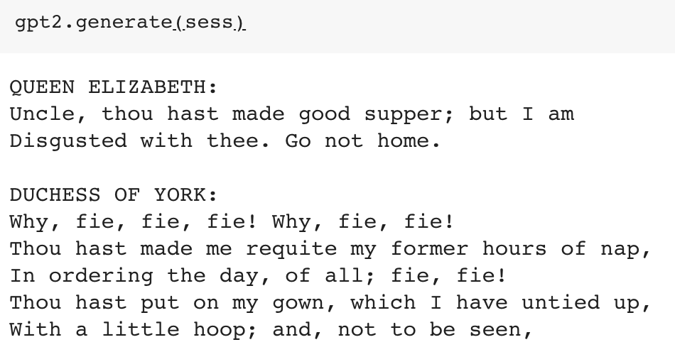

# gpt-2-simple



A simple Python package that wraps existing model fine-tuning and generation scripts for [OpenAI](https://openai.com)'s [GPT-2 text generation model](https://openai.com/blog/better-language-models/) (specifically the "small", 117M hyperparameter version). Additionally, this package allows easier generation of text, generating to a file for easy curation, allowing for prefixes to force the text to start with a given phrase.

This package incorporates and makes minimal low-level changes to:

* Model management from OpenAI's [official GPT-2 repo](https://github.com/openai/gpt-2) (MIT License)
* Model finetuning from Neil Shepperd's [fork](https://github.com/nshepperd/gpt-2) of GPT-2 (MIT License)
* Text generation output management from [textgenrnn](https://github.com/minimaxir/textgenrnn) (MIT License / also created by me)

For finetuning, it is **strongly** recommended to use a GPU, although you can generate using a CPU (albeit much more slowly). If you are training in the cloud, using a Colaboratory notebook or a Google Compute Engine VM w/ the [TensorFlow Deep Learning](https://cloud.google.com/deep-learning-vm/) image is strongly recommended. (as the GPT-2 model is hosted on GCP)

You can use gpt-2-simple to retrain a model using a GPU **for free** in [this Colaboratory notebook](https://colab.research.google.com/drive/1VLG8e7YSEwypxU-noRNhsv5dW4NfTGce), which also demos additional features of the package.

## Install

gpt-2-simple can be installed [via PyPI](https://pypi.org/project/gpt_2_simple/):

```shell
pip3 install gpt_2_simple
```

You will also need to install the corresponding TensorFlow for your system (e.g. `tensorflow` or `tensorflow-gpu`)

## Usage

An example for downloading the model to the local system, fineturning it on a dataset. and generating some text.

Warning: the pretrained model, and thus any finetuned model, is 500 MB!

```python
import gpt_2_simple as gpt2

gpt2.download_gpt2()   # model is saved into current directory under /models/117M/

sess = gpt2.start_tf_sess()
gpt2.finetune(sess, 'shakespeare.txt', steps=1000)   # steps is max number of training steps

gpt2.generate(sess)
```

The generated model checkpoints are by default in `/checkpoint/run1`. If you want to load a model from that folder and generate text from it:

```python
import gpt_2_simple as gpt2

sess = gpt2.start_tf_sess()
gpt2.load_gpt2(sess)

gpt2.generate(sess)
```

As with textgenrnn, you can generate and save text for later use (e.g. an API or a bot) by using the `return_as_list` parameter.

```python
single_text = gpt2.generate(sess, return_as_list=True)[0]
print(single_text)
```

You can pass a `run_name` parameter to `finetune` and `load_gpt2` if you want to store/load multiple models in a `checkpoint` folder.

NB: *Restart the Python session first* if you want to finetune on another dataset or load another model.

## Differences Between gpt-2-simple And Other Text Generation Utilities

The method GPT-2 uses to generate text is slightly different than those like other packages like textgenrnn (specifically, generating the full text sequence purely in the GPU and decoding it later), which cannot easily be fixed without hacking the underlying model code. As a result:

* In general, GPT-2 is better at maintaining context over its entire gereration length, making it good for generating conversational text. The text is also generally gramatically correct, with proper capitalization and few typoes.
* The original GPT-2 model was trained on a *very* large variety of sources, allowing the model to incorporate trends not seen in the input text.
* GPT-2 can only generate a maximum of 1024 tokens per request (about 3-4 paragraphs of English text).
* GPT-2 cannot stop early upon reaching a specific end token. (workaround: pass the `truncate` parameter to a `generate` function to only collect text until a specified end token. You may want to reduce `length` appropriately.)
* Higher temperatures work better (e.g. 0.7 - 1.0) to generate more interesting text, while other frameworks work better between 0.2 - 0.5.
* When finetuning GPT-2, it has no sense of the beginning or end of a document within a larger text. You'll need to use a bespoke character sequence to indicate the beginning and end of a document. Then while generating, you can specify a `prefix` targeting the beginning token sequences, and a `truncate` targeting the end token sequence.
* GPT-2 allows you to generate texts in parallel by setting a `batch_size` that is divisible into `nsamples`, resulting in much faster generation. Works very well with a GPU (can set `batch_size` up to 20 on Colaboratory's K80)!

## Planned Work

Note: this project is intended to have a very tight scope unless demand dictates otherwise.

* Allow users to generate texts longer than 1024 tokens. ([GitHub Issue](https://github.com/minimaxir/gpt-2-simple/issues/2))
* Allow users to use Colaboratory's TPU for finetuning. ([GitHub Issue](https://github.com/minimaxir/gpt-2-simple/issues/3))
* Allow users to use multiple GPUs (e.g. Horovod)
* For Colaboratory, allow model to automatically save checkpoints to Google Drive during training to prevent timeouts.

## Examples Using gpt-2-simple

* [ResetEra](https://www.resetera.com/threads/i-trained-an-ai-on-thousands-of-resetera-thread-conversations-and-it-created-hot-gaming-shitposts.112167/) — Generated video game forum discussions

## Maintainer/Creator

Max Woolf ([@minimaxir](http://minimaxir.com))

*Max's open-source projects are supported by his [Patreon](https://www.patreon.com/minimaxir). If you found this project helpful, any monetary contributions to the Patreon are appreciated and will be put to good creative use.*

## License

MIT

## Disclaimer

This repo has no affiliation or relationship with OpenAI.